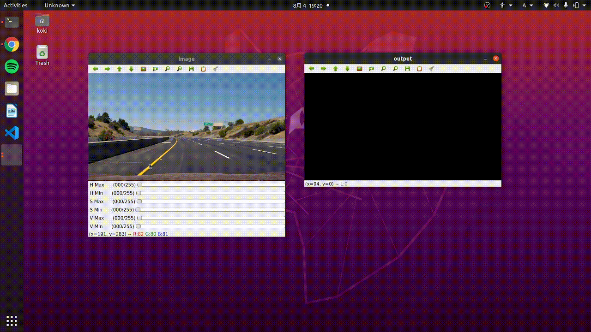

# HSV parameters trackbar

>## Table of contents
<p align="center">
<a href="#motivation" style="font-size: 20px">Motivation<br></a>
<a href="#installation" style="font-size: 20px">Installation<br></a>
<a href="#usage" style="font-size: 20px">Usage<br></a>
</p>

***


<a name="motivation"></a>
>## Motivation
I was trying to create a lane detection program using HSV to detect yellow and white lanes. Modifying my code just for the HSV parameters was buggin me. So I made this app to enhance productivity and stop wasting time.

***
<a name="install"></a>
>## Installation

You need to install **Opencv** and **Numpy**.<br>
Download my github repository on your device
```
git clone https://github.com/koki1610168/hsvTrackbar.git
```
<a name="usage"></a>
>## Usage
Run main.py
```
python main.py
```
After you run the above file, you will see two panes pop up on your window. One pane with trackbars is where you can play around with parameters. The other one is the gray scaled result.

**Congratulations!**
